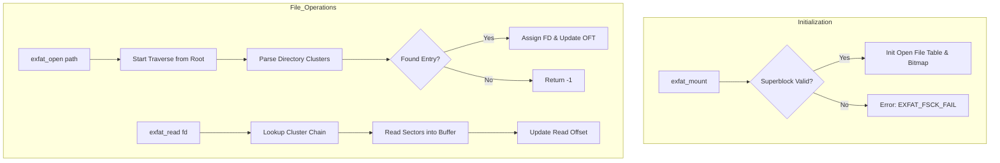
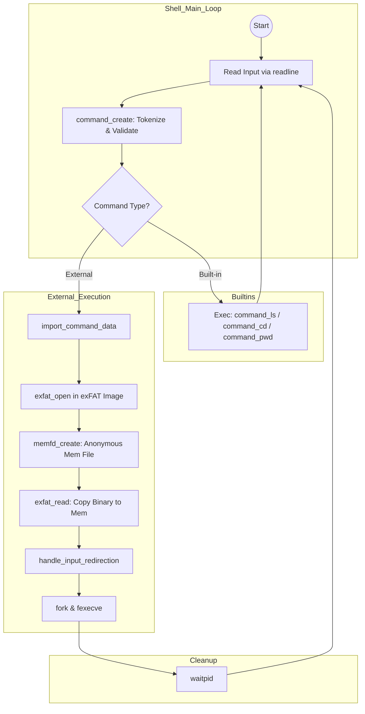

# CustomShell: A Process-based Shell with exFAT Drivers

A robust, processes-oriented Unix-like shell implemented in C that interfaces with a custom **exFAT read driver**. This project demonstrates deep understanding of systems programming, filesystem specifications, process management, and in-memory execution.

## Key Features

- **Custom exFAT Driver**: Full implementation of a read-only driver for the exFAT filesystem, allowing the shell to interact with disk images directly.
- **In-Memory Execution**: Executes external commands by loading binary data from the exFAT filesystem into an anonymous memory file (`memfd_create`) and running it via `fexecve`.
- **Command Piping & Redirection**: Support for complex command chains using pipes (`|`) and input redirection (`<`).
- **Rich Built-ins**: Native support for `ls`, `cd`, `pwd`, and `logging` controls.
- **Advanced CLI**: Enhanced user experience using the GNU Readline library for command history and navigation.

> [!CAUTION]
> **Academic Integrity Notice**: To prevent academic misconduct incidents from future students in future course offerings, I have intentionally made sure this code doesn't compile or run at all. Feel free to reach out if you want to talk about a working version.

---

## Architecture & Logic Flow

The project is divided into two main layers: the **Shell Interface** and the **exFAT Read Drivers**.

### 1. exFAT Read Driver Logic
The driver handles the low-level details of parsing the exFAT structure, traversing cluster chains, and managing file descriptors within the mounted disk image.



### 2. Whole Project Flow
The shell orchestrates user input, command parsing, and process execution, bridging the physical disk image to active execution contexts.



---

## Build & Usage

### Prerequisites
- `clang` or `gcc`
- `libreadline` development headers

### Build the Program
```bash
make all
```

### Run the Shell
```bash
# Default run with root.img
make run

# Run with custom logging
make run_logs LOG_FILE=session.log
```

### Debugging
This project was developed with a heavy emphasis on robust debugging:
```bash
# Debug using LLDB GUI
make debug
```

---

## What I Learned

This project was a deep dive into the internals of operating systems and filesystems. Key takeaways include:

- **Filesystem Internals**: Gained a granular understanding of how **exFAT** organizes data, from the Main Boot Region to Cluster Heap traversal and Directory Entry sets.
- **Advanced Debugging with LLDB/GDB**: Moving beyond `printf`, I mastered the **LLDB GUI (TUI mode)**. Using frame inspection, memory watches, and step-through debugging allowed me to solve complex state-related bugs in the FAT chain traversal.
- **Process Management**: Learned the intricacies of the `fork-exec` model, specifically how to manage file descriptors across pipes and handle process synchronization with `waitpid`.
- **In-Memory Security & Efficiency**: Implemented **anonymous file descriptors** via `memfd_create`. This allows executing binaries without them ever touching the host's actual disk, increasing both speed and security.
- **C Memory Safety**: Reinforced strict memory management practices, ensuring all dynamically allocated command objects and directory entries are properly cleaned up.

---

## Author
**Krish Bhalala**
