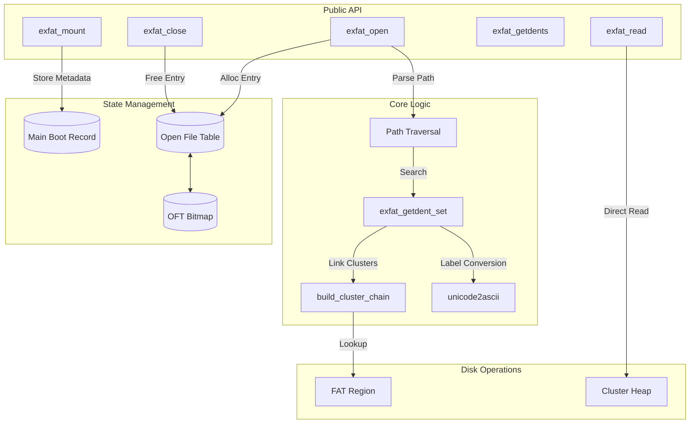

# exFAT Read-Only Driver

A custom read-only driver for the **exFAT (Extended File Allocation Table)** filesystem, providing a POSIX-like interface (`open`, `read`, `close`, `getdents`) for interacting with exFAT disk images.

> [!CAUTION]
> **Academic Integrity Notice**: To prevent academic misconduct incidents from future students in future course offerings, I have intentionally made sure this code doesn't compile or run at all. Feel free to reach out if you want to talk about a working version.

---

## Overview

This directory contains:

* A generic, POSIX-like interface for opening and reading files in a file system (`exfat_io.h`).
* Example programs that use this interface (`cat.c`, `ls.c`, and `paste.c`).
* An exFAT-specific set of types and values (`exfat_types.h`).
* The core driver implementation (`exfat_driver.c`).

---

## Architecture & Data Flow

The driver is designed as a layered system that translates high-level path requests into low-level sector offsets.



---

## Key Components

### 1. Main Boot Record (MBR) Parsing
Upon calling `exfat_mount`, the driver reads the first sector of the image to populate the `main_boot_record` structure. Significant fields tracked include:
- `fat_offset` & `fat_length`: Location of the File Allocation Table.
- `cluster_heap_offset`: Start of the actual data clusters.
- `bytes_per_sector_shift` & `sectors_per_cluster_shift`: Used for calculating physical addresses.

### 2. Open File Table (OFT)
To stay process-oriented, the driver maintains an internal `open_file_table`. Each entry stores:
- `first_cluster`: The starting point of the file.
- `cluster_chain`: An array of all clusters belonging to the file, pre-computed for performance.
- `current_position`: The byte offset for subsequent read calls.

### 3. exFAT Directory Entry Sets
ExFAT uses a "set" of entries to describe a single file. `exfat_getdent_set` is responsible for grouping:
1. **File Directory Entry**: Contains attributes and secondary count.
2. **Stream Extension Entry**: Contains the `first_cluster` and `data_length`.
3. **File Name Entries**: One or more entries containing Unicode characters of the name.

---

## File Manifest

| File | Description |
| :--- | :--- |
| `exfat_driver.c` | Main driver logic: mounting, opening, reading, and traversal. |
| `exfat_types.h` | Struct definitions for MBR, Dentries, and offsets based on exFAT spec. |
| `exfat_io.h` | Shared error codes and public function signatures. |

---

## Sample Programs

### `cat.c`
Prints the contents of files from an exFAT image to standard output.

```bash
./cat disk.img /path/to/file.txt
```

### `ls.c`
Lists directory contents from an exFAT image.

```bash
./ls disk.img /path/to/directory
```

### `paste.c`
Pastes two files side-by-side from an exFAT image.

```bash
./paste disk.img /file1.txt /file2.txt
```

---

## Technical Implementation Details

- **Path Resolution**: The `exfat_open` function tokenizes paths (e.g., `/folder/file.txt`) and iteratively searches directory entry sets cluster-by-cluster.
- **Cluster Chain Cache**: To avoid repeated FAT lookups during `read` calls, the entire cluster chain is resolved and stored in memory when a file is first opened.
- **Anonymous Memory Execution**: In the main shell, data read via `exfat_read` is piped into `memfd_create` to allow executing exFAT binaries as native processes.

---

## What I Learned

Building this driver provided deep insights into:

- **Filesystem Internals**: Understanding how exFAT organizes data, from the Main Boot Region to Cluster Heap traversal and Directory Entry sets.
- **Low-Level I/O**: Working directly with sector offsets, binary data parsing, and bit-level struct packing.
- **Memory Management**: Implementing robust allocation/deallocation patterns for cluster chains and file descriptors.
- **Debugging Complex State**: Using LLDB/GDB to trace through multi-layered FAT chain traversals.
